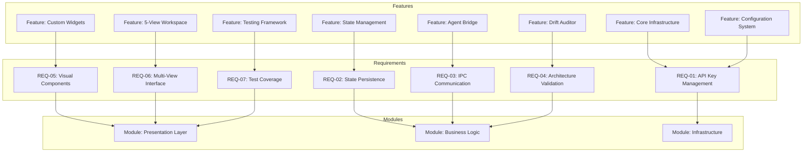
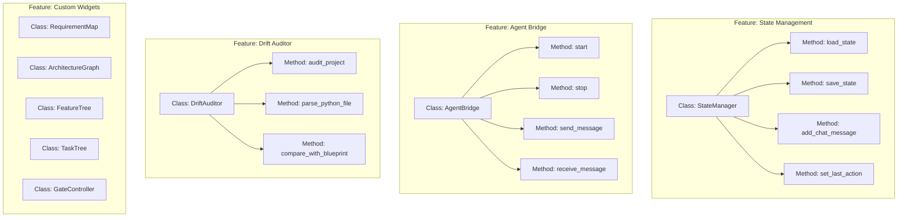
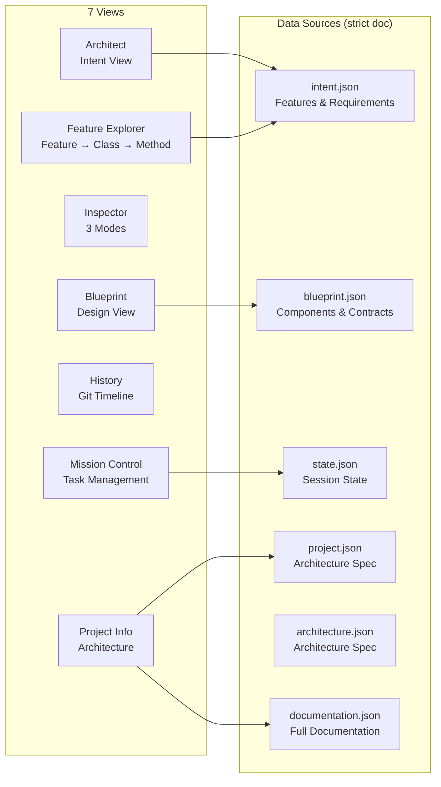
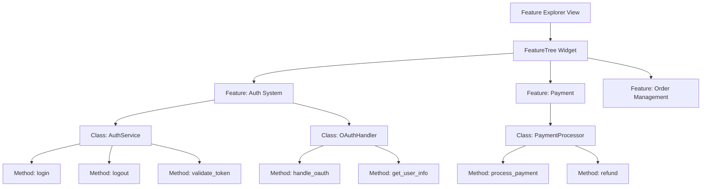
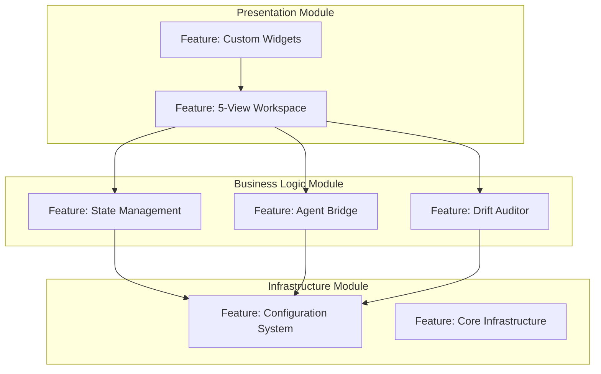
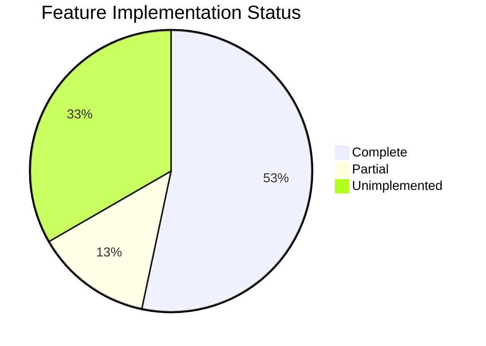
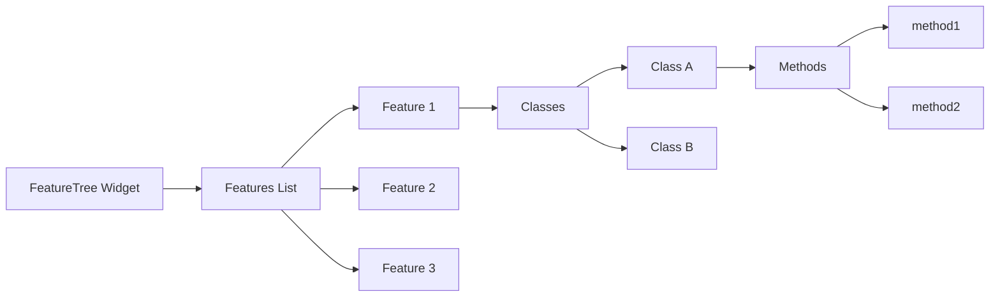
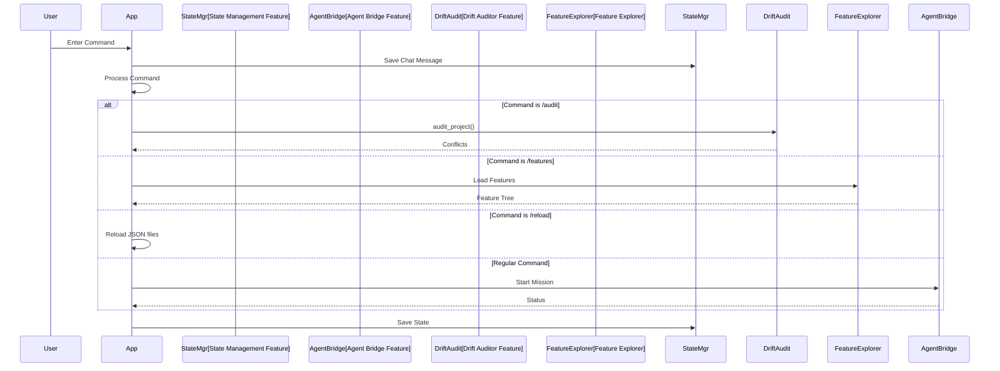
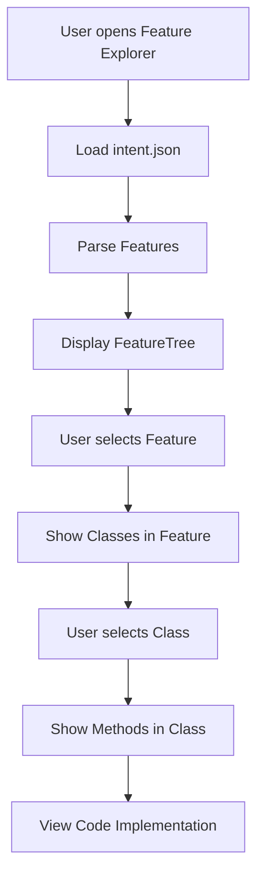
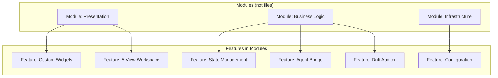

# Manifest 프로젝트 시각화

## 1. Feature 중심 아키텍처 구조



## 2. Feature → Class → Method 계층 구조



## 3. 뷰 구조 및 데이터 흐름 (strict doc > view)



## 4. Feature Explorer 구조



## 5. Module 의존성 (Feature 기반)



## 6. 데이터 모델 관계 (Feature 중심)

```mermaid
erDiagram
    INTENT ||--o{ FEATURE : "contains"
    FEATURE ||--o{ REQUIREMENT : "has"
    FEATURE ||--o{ CLASS : "implements"
    CLASS ||--o{ METHOD : "contains"

    BLUEPRINT ||--o{ COMPONENT : "specifies"
    COMPONENT ||--o{ CONTRACT : "defines"

    PROJECT ||--o{ MODULE : "organizes"
    MODULE ||--o{ FEATURE : "contains"

    STATE ||--o{ MISSION_TREE : "tracks"
    STATE ||--o{ TASK_CHECKLIST : "tracks"
    STATE ||--o{ CHAT_HISTORY : "stores"
```

## 7. 구현 상태 (Feature 기반)



## 8. Feature Explorer 위젯 구조



## 9. 명령 처리 흐름 (Feature 기반)



## 10. 프로젝트 통계 (Feature 기반)

### Feature 통계
- **완료된 Feature**: 8개
- **부분 구현 Feature**: 2개
- **미구현 Feature**: 5개

### Feature별 구현 상태
- ✅ Core Infrastructure (100%)
- ✅ Configuration System (100%)
- ✅ State Management (100%)
- ✅ Agent Bridge (100%)
- ✅ Drift Auditor (100%)
- ✅ Custom Widgets (100%)
- ✅ 5-View Workspace (100%)
- ✅ Testing Framework (100%)
- ⚠️ Bootstrap UI (50%)
- ⚠️ Git Integration (70%)
- ❌ Multi-Agent System (0%)
- ❌ Context Injection (0%)
- ❌ Structural Management (0%)
- ❌ Shadow Manager (0%)
- ✅ Agent System Integration (100%)

## 11. Feature Explorer 사용 흐름



## 12. 데이터 파일 구조 (Feature 중심)

```
.manifest/
├── intent.json          ← Features & Requirements (strict doc)
├── blueprint.json       ← Components & Contracts (strict doc)
├── architecture.json    ← Architecture Spec (strict doc)
├── project.json         ← Project Architecture (strict doc)
├── documentation.json   ← Full Documentation (strict doc)
└── state.json           ← Session State
```

각 JSON 파일은 해당 뷰에서 렌더링됩니다 (strict doc > view 패턴).

## 13. Feature 중심 아키텍처 원칙

1. **Feature First**: 모든 아키텍처 표현은 Feature를 중심으로 구성
2. **Requirement Mapping**: 각 Feature는 Requirements와 연결
3. **Module Organization**: Features는 Modules로 그룹화
4. **Class/Method Hierarchy**: Feature → Class → Method 계층 구조
5. **Strict Doc > View**: JSON 문서가 뷰의 단일 소스

## 14. Feature Explorer 구현 상세

### 데이터 구조
```json
{
  "features": [
    {
      "id": "feature-1",
      "name": "Auth System",
      "status": "done",
      "classes": [
        {
          "id": "class-1",
          "name": "AuthService",
          "methods": [
            {"id": "method-1", "name": "login"},
            {"id": "method-2", "name": "logout"}
          ]
        }
      ]
    }
  ]
}
```

### 위젯 동작
- Feature 선택 시 해당 Feature의 Classes 표시
- Class 선택 시 해당 Class의 Methods 표시
- Method 선택 시 코드 구현 위치 표시 (향후 구현)

## 15. 아키텍처 레이어 (Module 기반)



**중요**: 아키텍처는 파일(`app.py`, `widgets.py`)이 아닌 **Module과 Feature** 중심으로 표현됩니다.
